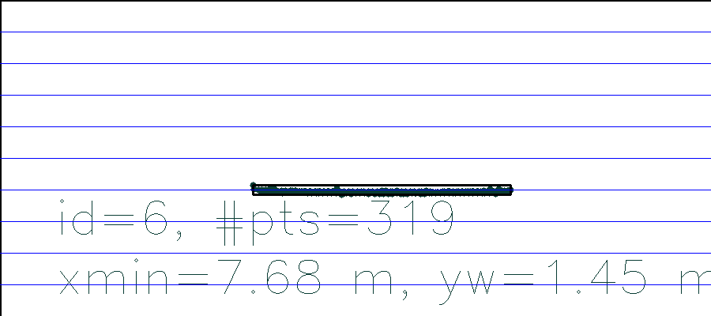
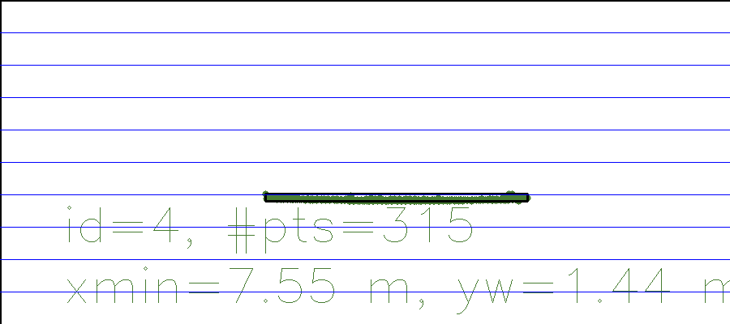

# SFND 3D Object Tracking

Welcome to the final project of the camera course. By completing all the lessons, you now have a solid understanding of keypoint detectors, descriptors, and methods to match them between successive images. Also, you know how to detect objects in an image using the YOLO deep-learning framework. And finally, you know how to associate regions in a camera image with Lidar points in 3D space. Let's take a look at our program schematic to see what we already have accomplished and what's still missing.

In this final project, you will implement the missing parts in the schematic. To do this, you will complete four major tasks: 
1. First, you will develop a way to match 3D objects over time by using keypoint correspondences. 
2. Second, you will compute the TTC based on Lidar measurements. 
3. You will then proceed to do the same using the camera, which requires to first associate keypoint matches to regions of interest and then to compute the TTC based on those matches. 
4. And lastly, you will conduct various tests with the framework. Your goal is to identify the most suitable detector/descriptor combination for TTC estimation and also to search for problems that can lead to faulty measurements by the camera or Lidar sensor. In the last course of this Nanodegree, you will learn about the Kalman filter, which is a great way to combine the two independent TTC measurements into an improved version which is much more reliable than a single sensor alone can be. But before we think about such things, let us focus on your final project in the camera course. 

## Dependencies for Running Locally
* cmake >= 2.8
  * All OSes: [click here for installation instructions](https://cmake.org/install/)
* make >= 4.1 (Linux, Mac), 3.81 (Windows)
  * Linux: make is installed by default on most Linux distros
  * Mac: [install Xcode command line tools to get make](https://developer.apple.com/xcode/features/)
  * Windows: [Click here for installation instructions](http://gnuwin32.sourceforge.net/packages/make.htm)
* OpenCV >= 4.1
  * This must be compiled from source using the `-D OPENCV_ENABLE_NONFREE=ON` cmake flag for testing the SIFT and SURF detectors.
  * The OpenCV 4.1.0 source code can be found [here](https://github.com/opencv/opencv/tree/4.1.0)
* gcc/g++ >= 5.4
  * Linux: gcc / g++ is installed by default on most Linux distros
  * Mac: same deal as make - [install Xcode command line tools](https://developer.apple.com/xcode/features/)
  * Windows: recommend using [MinGW](http://www.mingw.org/)

## Basic Build Instructions

1. Clone this repo.
2. Make a build directory in the top level project directory: `mkdir build && cd build`
3. Compile: `cmake .. && make`
4. Run it: `./3D_object_tracking`.

1. Implement the method "matchBoundingBoxes", which takes as input both the previous and the current data frames and provides as output the ids of the matched regions of interest

MatchboudingBoxes is a function that takes as input a pair of matched keypoints, as well as keypoints from the previous and current frames. In this function, the first step in matching the previous bounding box to a current boundingbox is to first establish a match between keypoints from the current frame and keypoints from the previous frame, and for those keypoints we were able to pair up we constrain them into bounding boxes with known ID. We then iterate through the matches and tally up the the ID pair and return only the most frequent one, which is the pair with the highest count.          

2. Compute the time-to-collision for all matched 3D objects using only Lidar measurements from the matched bounding boxes between current and previous frame.

To compute the TTC with LiDAR points only, we iterated through all the lidar cloud points and identify the lidar point closest to our vehicle. Then assuming a constant speed model the TTC was computed using the equation provided. 
However, outliers lidar points that for example reflected off the road surface and appear closest could be selected as valid data point and that thus lead to an erroneous TTC measurement. To deal with outliers, we first stored all lidar points into a KD_tree data structure, and then cluster them based on their euclidean distance. Clusters with large distance were labeled as outliers and were removed from the tree. This part of the code can be found on LidarClustering function.  

3. Prepare the TTC computation based on camera measurements by associating keypoint correspondences to the bounding boxes which enclose them. All matches which satisfy this condition must be added to a vector in the respective bounding box.

The function clusterKptMatchesWithROI associates each bounding box with the keypoints it contains. This is done by iterating through all the matched keypoints, and for keypoint that was found in our established region of interest of the current bounding box, the matched pair is saved and to be used in the  calculation the camera based TTC.

4. Compute the time-to-collision for all matched 3D objects using only keypoint correspondences from the matched bounding boxes between current and previous frame.

We measure the time to collision by observing relative change in the distance between two keypoints inside a bounding box. 
To do so, we first locate uniquely identifiable keypoints that and tracked them from one frame to the next. The distance between all keypoints relative to each other is then use to compute TTC based on the equation provided.

## FP.5 Performance Evaluation 1: Find examples where the TTC estimate of the Lidar sensor does not seem plausible. Describe your observations and provide a sound argumentation why you think this happened.

|                    | Example 1  | Example 2 | Example 3      
| ------------------ |:---------- |:----------|:--------:|
| TTC (Lidar) (sec)  | 7.11       |  9.34     | 34.34    | 
| TTC (Camera) (sec) | 12.67      |  12.83    | 13.41    |

Example 1 and example 2 show the lidar TTC well below the camera TTC. A closed inspection of the lidar points show the presence of outliers despite the fact that an Euclidean clustering algorithm was implemented to address this specific issue. 

Example 3 show the lidar TTC well above the camera TTC. This might be due to the fact that the road might not be flat. For example if the car is on a bump, the distance to the nearest point will be larger compare to a case where the car is moving a flat surface.   

## FP.6 Performance Evaluation 2
## Average TTC for various detector/descriptor combinations.

|               | SIFT  | BRIEF    | BRISK   | ORB     | FREAK  | AKAZE |    
| ------------- |:----- |:---------|:--------|:--------|:-------|:-----:|
| Shitomasi     | 11.71 |  12.13   | 14.74   | 11.69   | 12.49  |  N/A   |
| Harris        | 17.54 |  12.50   | 15.697  | 12.30   | 19.62  |  N/A   |
| ORB           | 12.56 |  21.61   | 317.201 | 15.72   | 18.02  |  N/A   |
| BRISK         | 15.59 |  14.89   | 14.04   | 13.85   | 14.48  |  N/A   |
| SIFT          | 12.51 | 11.89    | 12.26   | out of memory     | 11.87  |  --   |
| FAST          | 13.17 | 12.52    | 14.72   | 11.85   | 13.70  |  --   |
| AKAZE         | 12.48 | 12.51    | 12.43   | 12.36   | 12.22  | 12.43 |

FAST + ORB provides the shortest TTC
